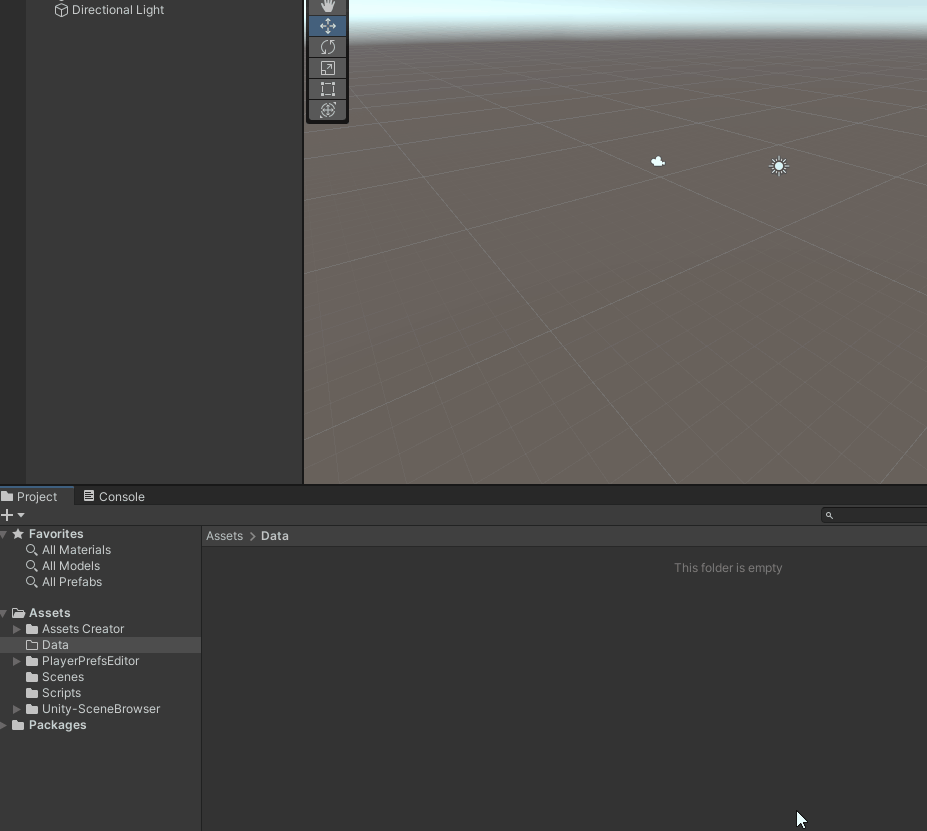

<h1 align="center">TF.AssetsCreator</h1>
 

Stop writing CreateAssetMenu foreach for your Scriptable Objects.

## Installation

- Project supports Unity Package Manager. To install the project as a Git package do the following:
1. In Unity, open **Window** -> **Package Manager**.   
2. Press the **+** button, choose "**Add package from git URL...**"   
3. Enter "https://github.com/Theo-Farnole/Unity-AssetsCreator#main" and press **Add**.   

## Credits

The initial window by [vanifatovvlad](https://gist.github.com/vanifatovvlad/d4850eb008149c06021f1cdd14ec84af) was using Odin Inspector. I remake it without Odin for those who don't have the plugin.
